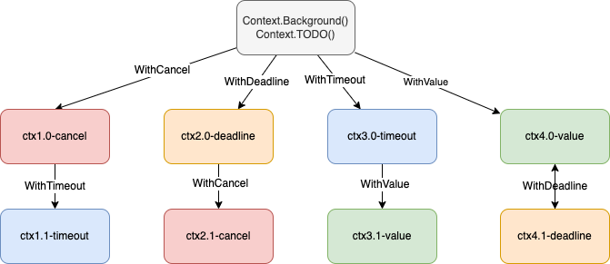

# [Golang pkg]: A top to bottom view of Context

## Intro

As a newbie to Golang, I decided to restart the habit of writing tech blogs, one to give me a better chance to pick up Golang faster, but most importantly, try to elevate my abilities as an engineer again, thoroughly.

Let's cut to the chase, today the topic is the `Context` package. After reading some materials online, I think it's best to start from basic usages of `Context`, and then dig deeper to the source code level.

Okay let's start! I'm sure you would often see code like this:

```go
func a1(ctx context ...) {
    b1(ctx)
}

func b1(ctx context ...) {
    c1(ctx)
}

func c1(ctx context ...) {

}

...
```

It is recommended by the Go team to use `context` as the first parameter, to pass it all the way down through out the application. But what exactly does `context` achieve? I recall the first time learning context, my mentor told me context is used for concurrency, and can be set with a timeout threshold. Moreover, go routines would be canceled immediately and return as soon as timeout occurs.

As an intern, I naively thought by passing `context` along the functions would achieve such functionalities, which is definitely incorrect. The cancel mechanism is based on a notification approach, so simply passing `context` won't do you any good. For example code written as below:

```go
func main()  {
    ctx, cancel := context.WithTimeout(context.Background(), 10 * time.Second)
    defer cancel()
    go Monitor(ctx)

    time.Sleep(20 * time.Second)
}

func Monitor(ctx context.Context)  {
    for {
        fmt.Print("monitor")
    }
}
```

Even `context` is passed to the `Monitor` function, not using it will not result in anything. So understanding the concept and usages of `context` is very important. We'll start by giving a high level understanding of `context`, and then dive deeper to a lower level of source code implementation, by then, you will have a solid grasp of `Context`.

## The effects of Context

1. `context` can be used to pass information between `goroutine`

2. same `context` can be passed to functions running in different `goroutine`

3. The `context` packages defined different types of `context`, you can use `background`, `TODO` to create a `context` and pass them between function calls

4. You can use `WithDeadline`, `WithTimeout`, `WithCancel`, `WithValue` to create a copy of `context` and modify it

As a conclusion, what `context` does is that it synchronously requests for certain data, cancels signals, and manages corresponding timeouts of requests between different `goroutine`.

## High level view: Usages of Context

### Create Context

`context` package provides two ways to create `context`:

- `context.Background()`
- `context.TODO()`

These two functions are actually merely aliases, no difference between them. If we really want to differentiate the slightest difference between them, let's take a look at what the Go team suggests:

- `context.Background()` is the default value of `context`, and other `context` should derive from which

- `context.TODO` should only be used when it's uncertain of which `context` should be used

So, most of the time we use `context.Background()` as the beginning of the `context` chain.

The two ways of creating `context` above simply creates a root `context`, which doesn't carry any functionality. In order to utilize `context`, you would have to rely on `With` functions provided by `Context`.

```go
func WithCancel(parent Context) (ctx Context, cancel CancelFunc)
func WithDeadline(parent Context, deadline time.Time) (Context, CancelFunc)
func WithTimeout(parent Context, timeout time.Duration) (Context, CancelFunc)
func WithValue(parent Context, key, val interface{}) Context
```

The four functions must be derived from a parent `Context`. By using these functions, we are able to create a `Context` tree, every node of the tree are allowed to have any number of children.

For example:



Based on a parent `Context`, the context tree can grow arbitrarily as shown above, using the four `With` functions provided.

This is all you need to know about creating `Context` and its additional functions. Now let's take a look at each function in detail.

### WithValue: carrying data

It is common for developers wishing to have a `trace_id` to bind all logs. In order to do so, it requires us to somehow gain access to `trace_id` when printing out logs. In Go, we use `Context` to pass `trace_id`. By using `WithValue` we create a `context` that carries a `trace_id`, and by penetrating the `context` along the `context` tree, we may have access to `trace_id` whenever needed. Take a look at an example:

```go
const (
	KEY    = "trace_id"
	format = "2006-01-02 15:04:05"
)

func NewRequestID() string {
	return strings.Replace(uuid.New().String(), "-", "", -1)
}

func NewContextWithTraceID() context.Context {
	ctx := context.WithValue(context.Background(), KEY, NewRequestID())
	return ctx
}

func PrintLog(ctx context.Context, message string) {
	fmt.Printf("%s|info|trace_id=%s|%s", time.Now().Format(format), GetContextValue(ctx, KEY), message)
}

func GetContextValue(ctx context.Context, k string) string {
	v, ok := ctx.Value(k).(string)
	if !ok {
		return ""
	}
	return v
}

func ProcessEnter(ctx context.Context) {
	PrintLog(ctx, "Golang Context")
}

func main() {
	ProcessEnter(NewContextWithTraceID())
}
```

- output

```
2023-06-26 15:49:15|info|trace_id=f3fa26ce540f4c449085ec4e23e354e2|Golang Context
[Done] exited with code=0 in 1.054 seconds
```

Based on `context.Background()`, we created a `ctx` carrying `trace_id`. By passing it down the `context` tree, any `context` that derives from which would have access to `trace_id`. Eventually, we are able to get the value of `trace_id` and log it out.

### WithTimeout / WithDeadline: timeout control

Most of the time, a robust system should take timeout issues into consideration in order to avoid excessive response from the server side, leading to resource starvation. As a result, many WEB/RPC frameworks adopts `withTimeout` / `withDeadline` to deal with timeout. When a single request reaches the timeout threshold set, it'll terminate immediately.

`withTimeout` and `withDeadline` are basically same. They differ only in the parameters passed to them. Both `withTimeout` / `withDeadline` will automatically cancel `Context` depending on the `timeout `passed to it.

Another useful functionality is that both `withTimeout` / `withDeadline` returns a `cancelFunc` function. Calling this function gives us the ability to cancel `Context` in advance. (It is still recommended to invoke `cancelFunc` even when `Context` is automatically terminated as good practice to avoid unnecessary resource consumation)

Take a look at the code below:

```go
func NewContextWithTimeout() (context.Context, context.CancelFunc) {
	return context.WithTimeout(context.Background(), time.Second*3)
}

func HttpHandler1() {
	ctx, cancel := NewContextWithTimeout()
	defer cancel()
	dealCancelAutomatically(ctx)
}

func HttpHandler2() {
	ctx, cancel := NewContextWithTimeout()
	defer cancel()
	dealCancelInAdvance(ctx, cancel)
}

func dealCancelAutomatically(ctx context.Context) {
	for i := 0; i < 10; i++ {
		time.Sleep(time.Second)
		select {
		case <-ctx.Done():
			fmt.Println(ctx.Err())
			return
		default:
			fmt.Printf("deal time is %d\n", i)
		}
	}
}

func dealCancelInAdvance(ctx context.Context, cancel context.CancelFunc) {
	for i := 0; i < 10; i++ {
		time.Sleep(time.Second)
		select {
		case <-ctx.Done():
			fmt.Println(ctx.Err())
			return
		default:
			fmt.Printf("deal time is %d\n", i)
			cancel()
		}
	}
}

func main() {
	// withTimeout
	fmt.Println("[withTimeout]: Cancel automatically")
	ctx.HttpHandler1()
	time.Sleep(time.Second)
	fmt.Println("[withTimeout]: Cancel manually in advance")
	ctx.HttpHandler2()
}
```

- output

```
[withTimeout]: Cancel automatically
deal time is 0
deal time is 1
context deadline exceeded
[withTimeout]: Cancel manually in advance
deal time is 0
context canceled
[Done] exited with code=0 in 6.318 seconds
```

As can seen, `withTimeout` enables us to control the timeout behavior of tasks on behalf of any `Context` easily.

### WithCancel: cancel control

When in development, we would often initiate multiple `goroutine` to complete a more complicated task. This potentially leads to starting multiple `goroutine` in one single request, which could be difficult to maintain them all at once. Most of the time, when multiple `goroutine` are initiated, we would want a way to terminate some of them anytime based on the logic we perform. But how should we achieve that?

`WithCancel` is the answer. In these cases, we could derive a root `Context` with `WithCancel` and pass it to multiple `goroutine`. When we want any of which `goroutine` to be canceled, we can call the `cancel` function to achieve it. Take a look at the example below:

```go
func Speak(ctx context.Context) {
	for range time.Tick(time.Second * 1) {
		select {
		case <-ctx.Done():
			fmt.Println("Shut up!")
			return
		default:
			fmt.Println("Keep talking...")
		}
	}
}

func main() {
	// withCancel
	ctx, cancel := context.WithCancel(context.Background())
	go Speak(ctx)
	time.Sleep(time.Second * 5)
	cancel()
	time.Sleep(time.Second)
}
```

- output

```
Keep talking...
...
...
...
Keep talking...
Shut up!

[Done] exited with code=0 in 6.463 seconds
```

In the code above, we created a `Context` based on `Background` with `WithCancel`. We then started a `goroutine` executing a `Speak` process, which speaks every 1 second. In the main function, we execute the `cancel` function after 5 seconds, as soon as `cancel` executes, the `goroutine` executing `Speak` would be signaled and will cancel the `goroutine` immediately. This example demonstrates the ability to gain control over multiple `goroutine` through the `WithCancel` and `Context` API.

## Low level view: Source code analysis

Context is actually an interface, defined by 4 methods:

```go
type Context interface {
    Deadline() (deadline time.Time, ok bool)
    Done() <-chan struct{}
    Err() error
    Value(key interface{}) interface{}
}
```

|   method   | description                                                                                |
| :--------: | :----------------------------------------------------------------------------------------- |
| Deadline() | returns when `Context` automatically cancelled or when cancelled due to timeout expiration |
|   Done()   | returns when `Context` cancelled or when `deadline` returns a closed channel               |
|   Err()    | returns the reason a `Context` cancelled                                                   |
|  Value()   | retrieves the corresponding value of a key associated with `Context`                       |

The `Context` interface is inherited and implemented using anonymous interfaces by 3 classes, `emptyCtx`, `ValueCtx`, `cancelCtx`.

### Creating Root Context: Background / TODO

As stated above, there are 2 ways to create root contexts: `context.Background`, `context.TODO`. When calling `context.Background`, `context.TODO`, we are actually creating `emptyCtx` objects.

```go
var (
    background = new(emptyCtx)
    todo       = new(emptyCtx)
)

func Background() Context {
    return background
}

func TODO() Context {
    return todo
}
```

You can see that both `Background` and `TODO` are identical. As a reminder, the GO team's explanation between them is that `Background` should be used as first choice serving as the topmost context passed; whereas `TODO` should only be used when it's not clear which `context` to be used, and should be replaced with a clear `context` whenever possible.

`emptyCtx` as seen above, mainly serves as an empty object when creating root contexts.

- emptyCtx source code:

```go
type emptyCtx int

func (*emptyCtx) Deadline() (deadline time.Time, ok bool) {
    return
}

func (*emptyCtx) Done() <-chan struct{} {
    return nil
}

func (*emptyCtx) Err() error {
    return nil
}

func (*emptyCtx) Value(key interface{}) interface{} {
    return nil
}

func (e *emptyCtx) String() string {
    switch e {
    case background:
        return "context.Background"
    case todo:
        return "context.TODO"
    }
    return "unknown empty Context"
}
```

### WithValue

The implementation of `withValue` relies on `valueCtx` object.

- withValue source code:

```go
func WithValue(parent Context, key, val interface{}) Context {
    if parent == nil {
        panic("cannot create context from nil parent")
    }
    if key == nil {
        panic("nil key")
    }
    if !reflectlite.TypeOf(key).Comparable() {
        panic("key is not comparable")
    }
    return &valueCtx{parent, key, val}
}
```

- valueCtx source code:

The goal of `valueCtx` is to carry a [K, V] pair for `Context`. Since anonymous interface used for inheritance, it'll inherit the parent `Context`, which implicitly embedds the [K, V] pair into the `Context`.

```go
type valueCtx struct {
    Context
    key, val interface{}
}
```

The `String` method prints information about the `Context` and [K, V] pair.

```go
func (c *valueCtx) String() string {
    return contextName(c.Context) + ".WithValue(type " +
        reflectlite.TypeOf(c.key).String() +
        ", val " + stringify(c.val) + ")"
}
```

Implements `Value` method to preserve [K, V] pair.

```go
func (c *valueCtx) Value(key interface{}) interface{} {
    if c.key == key {
        return c.val
    }
    return c.Context.Value(key)
}
```

From the code we can infer that when we call `Value()` on `Context`, it will go all the way till the root `Context`. If during the way along any [K, V] pair found, simply return the result, if not, it'll eventually reach `emptyCtx` and return `nil`.

### WithCancel

Let's take a look at the entry point of `WithCancel`:

```go
func WithCancel(parent Context) (ctx Context, cancel CancelFunc) {
    if parent == nil {
        panic("cannot create context from nil parent")
    }
    c := newCancelCtx(parent)
    propagateCancel(parent, &c)
    return &c, func() { c.cancel(true, Canceled) }
}
```

The steps of this function is:

1. create a `cancelCtx` object as the child `context`

2. call `propogateCancel` to bind `parent` and `child context`. This allows the `child context` to be cancelled whenever the `parent context` is cancelled

3. return the `child` context and a `cancel` function that acts on the `child` context

Now that we have a big picture, let's analyze `cancelCtx` object.

#### cancelCtx

`cancelCtx` inherits `Context`, and also implemented the interface `canceler`.

```go
type cancelCtx struct {
    Context

    mu       sync.Mutex            // protects following fields
    done     atomic.Value          // of chan struct{}, created lazily, closed by first cancel call
    children map[canceler]struct{} // set to nil by the first cancel call
    err      error                 // set to non-nil by the first cancel call
}
```

|  fields  | description                                                                                                                                                                    |
| :------: | :----------------------------------------------------------------------------------------------------------------------------------------------------------------------------- |
|    mu    | mutex lock ensures concurrent security                                                                                                                                         |
|   done   | serves as the notification signal when `context` is cancelled                                                                                                                  |
| children | the key of the map is `canceler` interface, serving to preserve child `context` nodes, so when parent `context` cancels, iterate through the map to cancel all child `context` |
|   err    | stores cancel info when cancellation of `context` occurs                                                                                                                       |

One of the most important part of `withCancel` is `propagateCancel`. So let's continue with `propagateCancel`.

#### propagateCancel

Let's jump right into the source code with comments of explanation.

```go
func propagateCancel(parent Context, child canceler) {
  // done == nil indicates that parent `context` will never be cancelled
  // therefore return directly
    done := parent.Done()
    if done == nil {
        return // parent is never canceled
    }

  // check in advance if parent `context` cancelled already
  // if so, no point in establishing cancellation chain
  // therefore cancel child `context` directly and return
    select {
    case <-done:
        // parent is already canceled
        child.cancel(false, parent.Err())
        return
    default:
    }

  // The goal here is to find `context` that can be mounted or cancelled
    if p, ok := parentCancelCtx(parent); ok {
        p.mu.Lock()

    // found `context` that can be mounted or cancelled
    // p.err != nil indicates `context` already cancelled, so cancel `child` context directly
    // or else preserve the `context` to establish cancellation chain
        if p.err != nil {
            child.cancel(false, p.err)
        } else {
            if p.children == nil {
                // initialize map
                p.children = make(map[canceler]struct{})
            }
            // preserve `child` context canceler in `parent` map
            // establish cancellation chain for future cancel operations
            p.children[child] = struct{}{}
        }
        p.mu.Unlock()
    } else {
    // no `parent` context that can be mounted or cancelled found
    // start a goroutine
    // cancel `child` context as soon as `parent` context is done
        atomic.AddInt32(&goroutines, +1)
        go func() {
            select {
            case <-parent.Done():
                child.cancel(false, parent.Err())
            case <-child.Done():
            }
        }()
    }
}
```

#### cancel

Now that we have established the cancellation chain between the `parent` and `child` context, we can finally go to the part that actually cancels `context`. Let's take a look at the source code of `cancel` with comments.

```go
func (c *cancelCtx) cancel(removeFromParent bool, err error) {
  // when cancelling a context the error parameter cannot be nil
  // context defined a default error: var Canceled = errors.New("context canceled")
    if err == nil {
        panic("context: internal error: missing cancel error")
    }
  // check the caller cancelCtx for err existence
  // err != nil indicates the current context have already been cancelled
    c.mu.Lock()
    if c.err != nil {
        c.mu.Unlock()
        return // already canceled
    }

    c.err = err

    d, _ := c.done.Load().(chan struct{})
    if d == nil {
        c.done.Store(closedchan)
    } else {
        close(d)
    }
  // iterate throught the map constructed in propagateCancel to cancel all of `child` contexts
    for child := range c.children {
        // NOTE: acquiring the child's lock while holding parent's lock.
        child.cancel(false, err)
    }
  // set the map to nil
    c.children = nil
    c.mu.Unlock()

    if removeFromParent {
        removeChild(c.Context, c)
    }
}
```

### withDeadline / withTimeout

First let's look at `withTimeout`. It is obvious that it relies on `withDeadline`.

```go
func WithTimeout(parent Context, timeout time.Duration) (Context, CancelFunc) {
    return WithDeadline(parent, time.Now().Add(timeout))
}
```

So of course it is essential to understand how `withDeadline` works.

```go
func WithDeadline(parent Context, d time.Time) (Context, CancelFunc) {
    if parent == nil {
        panic("cannot create context from nil parent")
    }

  // if the `parent` context's deadline is earlier than the specified time
  // there is no need to deal with timer problems
    if cur, ok := parent.Deadline(); ok && cur.Before(d) {
        // The current deadline is already sooner than the new one.
        return WithCancel(parent)
    }
  // create a timerCtx object
    c := &timerCtx{
        cancelCtx: newCancelCtx(parent),
        deadline:  d,
    }
  // mount the current timerCtx to the parent context
  // establish cancellation chain
    propagateCancel(parent, c)

  // get the duration until specified deadline
    dur := time.Until(d)
  // cancel directly if current time has already expired
    if dur <= 0 {
        c.cancel(true, DeadlineExceeded) // deadline has already passed
        return c, func() { c.cancel(false, Canceled) }
    }
    c.mu.Lock()
    defer c.mu.Unlock()
  // if not cancelled add a timer to cancel context when time is up
    if c.err == nil {
        c.timer = time.AfterFunc(dur, func() {
            c.cancel(true, DeadlineExceeded)
        })
    }
    return c, func() { c.cancel(true, Canceled) }
}
```

After reading the source code of `withDeadline`, you might notice that compared to `withCancel`, `withDeadline` simply adds a timer to call `cancel` if needed when time is up. `timerCtx` overrides the `cancel` method. Take a look at `timerCtx`, which is based on `cancelCtx`, but with 2 more fields.

```go
// A timerCtx carries a timer and a deadline. It embeds a cancelCtx to
// implement Done and Err. It implements cancel by stopping its timer then
// delegating to cancelCtx.cancel.
type timerCtx struct {
	*cancelCtx
	timer *time.Timer // Under cancelCtx.mu.

	deadline time.Time
}
```

As seen in the Go team comment of `timerCtx`, `timerCtx` implements `cancel` by stopping its timer then delegating to `cancelCtx.cancel`. So let's take a step further to look at the `cancel` implemented by `timerCtx`.

```go
func (c *timerCtx) cancel(removeFromParent bool, err, cause error) {
    // invoke `cancelCtx.cancel` to cancel the `timerCtx` context
	c.cancelCtx.cancel(false, err, cause)
	if removeFromParent {
		// Remove this timerCtx from its parent cancelCtx's children.
		removeChild(c.cancelCtx.Context, c)
	}
	c.mu.Lock()
	if c.timer != nil {
        // stop the timer and free all resource
		c.timer.Stop()
		c.timer = nil
	}
	c.mu.Unlock()
}
```

## Conclusion

In the article, we covered the fundamental concepts, basic usages and a deep dive into the source code of `Context`. I do hope if any one of you patient enough to finish reading this article do get something out of this regarding the topic of `Context` in Golang. As a newbie to Go, I feel like this is an extremely important topic to learn to get a better understanding at both backend development or Go the language itself. Thanks for reading, and feel free to contact me or share your ideas, any suggestions are more than welcome!

## references

| ref                                                      | link                                                            |
| :------------------------------------------------------- | :-------------------------------------------------------------- |
| Go source code                                           | https://github.com/golang/go/blob/master/src/context/context.go |
| Should we pass go context.Context to all the components? | https://github.com/dapr/dapr/issues/2716                        |
| 【Go 语言】小白也能看懂的 context 包详解：从入门到精通   | https://segmentfault.com/a/1190000040917752                     |
| golang 结构体中的匿名接口                                | https://www.cnblogs.com/morya/p/9251889.html                    |
