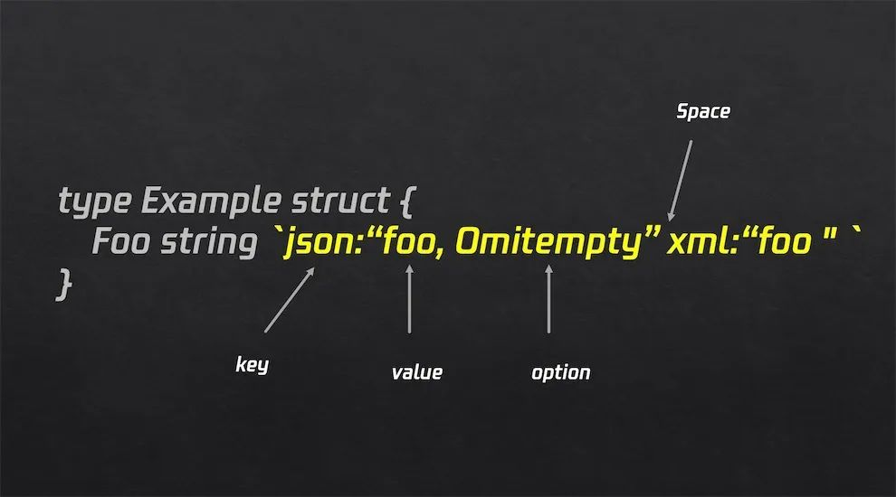

# [Golang]: What are struct tags and why do we use them in Go?

## Outline

- [Intro](#intro)
- [What are tags?](#what-are-tags)
- [Tags usages scenarios](#tags-usages-scenarios)
- [Customized struct tags](#customized-struct-tags)
- [Conclusion](#conclusion)

## Intro

Today I want to share the usages of struct tags in Go, and how should you define your own custom tags.

I'm sure if you are a new member on a SWE team, you would have to read the codebase first, at least that's what I had to do. For me, when I was doing so, I often see structs defined like this:

```go
type Location struct {
	Longitude float32 `json:"lon,omitempty"`
	Latitude  float32 `json:"lat,omitempty"`
}
```

There is a tag after the struct fields. So what exactly is this?

In the above example, the `tag json:"lon,omitempty" `means that when the value of the struct field is encoded as a json object, each exported field becomes a member of the object, and the name of this member is `lon` or `lat`, and When the field is empty, the field is not exported. In other words, `lon` and `lat` are the names of the renamed members, and `omitempty` is used to determine whether the member is exported.

Now you may wonder how did I learn the usages of such trivial syntax. Or even if you are allowed to create tags arbitratily. To answer you, let's keep on reading this article!

## What are tags?

The Go language provides struct tags that can be discovered through reflection. These are widely used in the standard library `json/xml`. The `orm` framework also supports struct tags. The use of the above example is because `encoding/json` supports struct body labels, but it has its own label rules. Neverthelss, they all have a general rule, which cannot be changed, and the specific format is as follows:

```
`key1:"value1" key2:"value2" key3:"value3"...`  // (K, V) pair separated by spaces
```



But what if we want to pass multiple values for one single field? Well this depends on the library you're working with. For instance, in `encoding/json`, multiple values are separated by commas:

```
`json:"lon,omitempty"`
```

In `gorm`, separated by semicolons:

```
`gorm:"column:id;primaryKey"
```

So in short, it is necessary to check with the documents regarding the support of struct tags of whatever library you're working with.

## Tags usages scenarios

`Go` officials have helped sort out which libraries support struct tag [Well known struct tags](https://github.com/golang/go/wiki/Well-known-struct-tags).

| Tag          | Documentation                                                                          |
| ------------ | -------------------------------------------------------------------------------------- |
| xml          | https://pkg.go.dev/encoding/xml                                                        |
| json         | https://pkg.go.dev/encoding/json                                                       |
| asn1         | https://pkg.go.dev/encoding/asn1                                                       |
| reform       | https://pkg.go.dev/gopkg.in/reform.v1                                                  |
| dynamodb     | https://docs.aws.amazon.com/sdk-for-go/api/service/dynamodb/dynamodbattribute/#Marshal |
| bigquery     | https://pkg.go.dev/cloud.google.com/go/bigquery                                        |
| datastore    | https://pkg.go.dev/cloud.google.com/go/datastore                                       |
| spanner      | https://pkg.go.dev/cloud.google.com/go/spanner                                         |
| bson         | https://pkg.go.dev/go.mongodb.org/mongo-driver/bson                                    |
| gorm         | https://pkg.go.dev/github.com/jinzhu/gorm                                              |
| yaml         | https://pkg.go.dev/gopkg.in/yaml.v2                                                    |
| toml         | https://pkg.go.dev/github.com/pelletier/go-toml                                        |
| validate     | https://github.com/go-playground/validator                                             |
| mapstructure | https://pkg.go.dev/github.com/mitchellh/mapstructure                                   |
| parser       | https://pkg.go.dev/github.com/alecthomas/participle                                    |
| protobuf     | https://github.com/golang/protobuf                                                     |
| db           | https://github.com/jmoiron/sqlx                                                        |
| url          | https://github.com/google/go-querystring                                               |
| feature      | https://github.com/nikolaydubina/go-featureprocessing                                  |

Struct tags of libraries such as `json`, `yaml`, `gorm`, `validate`, `mapstructure`, and `protobuf` are very commonly used. The gin framework also integrates the validate library for parameter verification, which is much more convenient.

## Customized struct tags

So now we may answer the question in the beginning. As long as your syntax is correct to the corresponding library you're working with, you may use struct tags however you wish.

However, there are still some libraries that don't support struct tags, hence random tags are meaningless. If we want our tags to become meaningful, we need to provide a parsing method. Tags can be obtained through reflection, so let's look at an example of how to use reflection to obtain custom structure tags.

```go
type User struct {
	Name string `cclin:"Username"`
	Age  uint16 `cclin:"age"`
	Password string `cclin:"min=6,max=10"`
}

func getTag(u User) {
	t := reflect.TypeOf(u)

	for i := 0; i < t.NumField(); i++ {
		field := t.Field(i)
		tag, ok := field.Tag.Lookup("cclin")
		if !ok {
			err := errors.New("no key in tag")
			fmt.Println(err.Error())
		}
		fmt.Println("Tag get is: ", tag)
	}
}

func main()  {
	u := User{
		Name: "cclin",
		Age: 5,
		Password: "12345",
	}
	getTag(u)
}
```

- output

```
Tag get is:  Username
Tag get is:  age
Tag get is:  min=6,max=10
```

We use `TypeOf` to obtain the type of the struct, then we iterate through all fields, which each of it possesses a member `Tag`:

```go
// A StructField describes a single field in a struct.
type StructField struct {
	// Name is the field name.
	Name string

	// PkgPath is the package path that qualifies a lower case (unexported)
	// field name. It is empty for upper case (exported) field names.
	// See https://golang.org/ref/spec#Uniqueness_of_identifiers
	PkgPath string

	Type      Type      // field type
	Tag       StructTag // field tag string
	Offset    uintptr   // offset within struct, in bytes
	Index     []int     // index sequence for Type.FieldByIndex
	Anonymous bool      // is an embedded field
}
```

We can see that `Tag` is a defined type `StructTag` which is another struct, that provides two methods to parse tags and retrieve the value of a given key:

```go
func (tag StructTag) Get(key string) string
func (tag StructTag) Lookup(key string) (value string, ok bool)
```

For simplicity we won't go into the implementation of `Get` and `Lookup`. The difference between them is that `Lookup` returns an additional boolean value `ok` to indicate whether a value corresponding to the given key exists in the `StructTag`.

## Conclusion

This is a simple introduction to struct tags in Go. As you might notice, struct tags are merely a general tool in Go, the actual usages depend on the library you are working with. For instance, in the codebase I was going through, I had to read documents of `mapstructure`, `validate` and `json`. So good luck with whatever library you're working with and I hope you get something out of this quick read.
